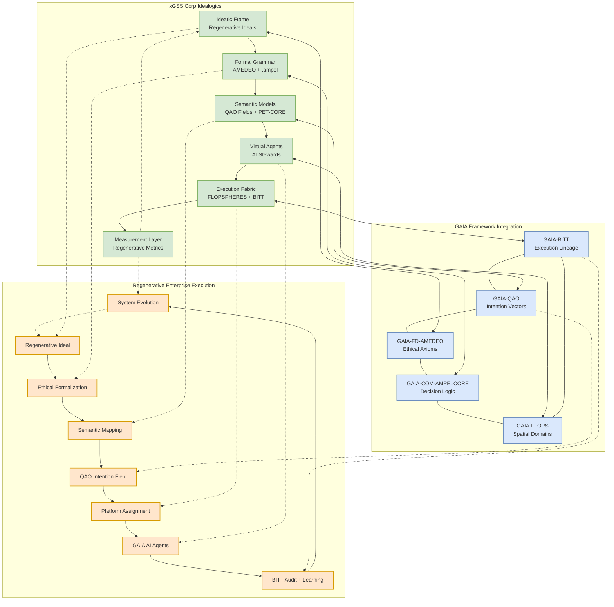

### xGSS Corp Idealogics: From Ideal to Virtual

> **GenAI Proposal Status**: This document represents a conceptual specification generated through AI assistance. It should be considered a proposal for implementing the xGSS Corp Idealogics framework as the semantic-ethical compiler that translates regenerative ideals into executable governance mechanisms within the GAIA architecture.


## 1. Executive Overview

xGSS Corp Idealogics serves as the semantic-ethical compiler of xGSS, translating regenerative ideals (ethical, ecological, social, systemic) into virtual constructs, executable governance mechanisms, decision protocols, and federated AI behavior. It functions as the epistemic-operational bridge between philosophical intent and enterprise-level execution, following the transformation path: Ideal → Formal → Semantic → Executable → Measurable → Evolvable.



## 2. Semantic `.ampel` Runtime

```plaintext
// xGSS Corp Idealogics Runtime
// File: xgss-idealogic-runtime.ampel
// Version: 1.0.0

namespace GAIA.xGSS.IDEALOGICS;

import GAIA.FD.AMEDEO;
import GAIA.FD.QAO;
import GAIA.FD.BITT;
import GAIA.FLOPS.EXECUTION;

// xGSS Corp Idealogics Runtime Definition
IdealogicsRuntime xGSS_IDEALOGICS_RUNTIME {
  runtime_id: "xGSS-IDEALOGICS-RT-001",
  description: "Semantic-ethical compiler for translating regenerative ideals into executable constructs",
  
  core_layers: {
    ideatic_frame: {
      description: "Declaration of regenerative ideals",
      elements: [
        {
          ideal: "wholeness",
          definition: "Recognition and support of the inherent integrity and completeness of systems",
          principles: [
            "System integrity preservation",
            "Holistic perspective integration",
            "Boundary respect and permeability",
            "Emergent property recognition"
          ],
          metrics: [
            "System integrity index",
            "Holistic perspective score",
            "Boundary health rating",
            "Emergence recognition measure"
          ]
        },
        {
          ideal: "reciprocity",
          definition: "Balanced and mutually beneficial exchanges between entities",
          principles: [
            "Value exchange balance",
            "Mutual benefit assurance",
            "Relationship nurturing",
            "Feedback loop completion"
          ],
          metrics: [
            "Value exchange ratio",
            "Mutual benefit index",
            "Relationship health score",
            "Feedback completion rate"
          ]
        },
        {
          ideal: "regeneration",
          definition: "Enhancement of system vitality and capacity over time",
          principles: [
            "Vitality enhancement",
            "Capacity building",
            "Self-renewal support",
            "Evolutionary potential increase"
          ],
          metrics: [
            "Vitality trend index",
            "Capacity development score",
            "Renewal rate measure",
            "Evolutionary potential rating"
          ]
        },
        {
          ideal: "diversity",
          definition: "Cultivation of variety, difference, and uniqueness",
          principles: [
            "Variety preservation",
            "Difference appreciation",
            "Uniqueness support",
            "Complementarity enhancement"
          ],
          metrics: [
            "Diversity index",
            "Difference value score",
            "Uniqueness support rating",
            "Complementarity measure"
          ]
        },
        {
          ideal: "participation",
          definition: "Meaningful engagement and contribution of all relevant entities",
          principles: [
            "Inclusive engagement",
            "Contribution opportunity",
            "Voice and influence assurance",
            "Co-creation facilitation"
          ],
          metrics: [
            "Inclusion index",
            "Contribution opportunity score",
            "Voice equity rating",
            "Co-creation level measure"
          ]
        }
      ],
      implementation: "Explicit articulation in all governance documents",
      verification: "Regular assessment of ideal expression and alignment"
    },
    
    formal_grammar: {
      description: "Encoded principles and ethics in AMEDEO and .ampel format",
      elements: {
        amedeo_axioms: {
          description: "Ethical axioms derived from ideals",
          mappings: [
            {
              ideal: "wholeness",
              axioms: [
                "AMEDEO::system_integrity >= 0.9",
                "AMEDEO::holistic_perspective >= 0.85",
                "AMEDEO::boundary_respect >= 0.9",
                "AMEDEO::emergence_recognition >= 0.8"
              ]
            },
            {
              ideal: "reciprocity",
              axioms: [
                "AMEDEO::value_exchange_ratio >= 1.0",
                "AMEDEO::mutual_benefit >= 0.9",
                "AMEDEO::relationship_nurturing >= 0.85",
                "AMEDEO::feedback_completion >= 0.9"
              ]
            },
            {
              ideal: "regeneration",
              axioms: [
                "AMEDEO::vitality_enhancement > 0",
                "AMEDEO::capacity_building > 0",
                "AMEDEO::self_renewal_support >= 0.85",
                "AMEDEO::evolutionary_potential >= 0.8"
              ]
            },
            {
              ideal: "diversity",
              axioms: [
                "AMEDEO::variety_preservation >= 0.9",
                "AMEDEO::difference_appreciation >= 0.85",
                "AMEDEO::uniqueness_support >= 0.85",
                "AMEDEO::complementarity >= 0.8"
              ]
            },
            {
              ideal: "participation",
              axioms: [
                "AMEDEO::inclusive_engagement >= 0.9",
                "AMEDEO::contribution_opportunity >= 0.9",
                "AMEDEO::voice_equity >= 0.85",
                "AMEDEO::co_creation >= 0.8"
              ]
            }
          ]
        },
        
        ampel_constructs: {
          description: "Formal grammar constructs in .ampel",
          mappings: [
            {
              ideal: "wholeness",
              constructs: [
                "SystemIntegrity::preserve(context)",
                "HolisticPerspective::integrate(decision)",
                "BoundaryRespect::maintain(interaction)",
                "EmergenceRecognition::monitor(system)"
              ]
            },
            {
              ideal: "reciprocity",
              constructs: [
                "ValueExchange::balance(transaction)",
                "MutualBenefit::ensure(relationship)",
                "RelationshipNurturing::practice(interaction)",
                "FeedbackLoop::complete(process)"
              ]
            },
            {
              ideal: "regeneration",
              constructs: [
                "VitalityEnhancement::implement(system)",
                "CapacityBuilding::support(entity)",
                "SelfRenewal::enable(process)",
                "EvolutionaryPotential::increase(context)"
              ]
            },
            {
              ideal: "diversity",
              constructs: [
                "VarietyPreservation::maintain(system)",
                "DifferenceAppreciation::practice(interaction)",
                "UniquenessSupport::provide(entity)",
                "Complementarity::enhance(relationship)"
              ]
            },
            {
              ideal: "participation",
              constructs: [
                "InclusiveEngagement::ensure(process)",
                "ContributionOpportunity::provide(context)",
                "VoiceEquity::maintain(interaction)",
                "CoCreation::facilitate(decision)"
              ]
            }
          ]
        }
      },
      implementation: "Formal encoding in AMEDEO and AMPEL systems",
      verification: "Syntactic and semantic validation of formal expressions"
    },
    
    semantic_models: {
      description: "Logical frameworks for ideal expression",
      elements: {
        qao_fields: {
          description: "Quantum Alignment Optimization fields",
          mappings: [
            {
              ideal: "wholeness",
              fields: [
                "QAO::field('system_integrity', context)",
                "QAO::field('holistic_perspective', decision_space)",
                "QAO::field('boundary_health', interaction_space)",
                "QAO::field('emergence_potential', system_space)"
              ]
            },
            {
              ideal: "reciprocity",
              fields: [
                "QAO::field('value_balance', exchange_space)",
                "QAO::field('mutual_benefit', relationship_space)",
                "QAO::field('nurturing_potential', interaction_space)",
                "QAO::field('feedback_completion', process_space)"
              ]
            },
            {
              ideal: "regeneration",
              fields: [
                "QAO::field('vitality_enhancement', system_space)",
                "QAO::field('capacity_building', entity_space)",
                "QAO::field('renewal_potential', process_space)",
                "QAO::field('evolutionary_trajectory', context_space)"
              ]
            },
            {
              ideal: "diversity",
              fields: [
                "QAO::field('variety_preservation', system_space)",
                "QAO::field('difference_value', interaction_space)",
                "QAO::field('uniqueness_support', entity_space)",
                "QAO::field('complementarity_potential', relationship_space)"
              ]
            },
            {
              ideal: "participation",
              fields: [
                "QAO::field('inclusion_potential', process_space)",
                "QAO::field('contribution_opportunity', context_space)",
                "QAO::field('voice_equity', interaction_space)",
                "QAO::field('co_creation_potential', decision_space)"
              ]
            }
          ]
        },
        
        pet_core_constraints: {
          description: "Pattern-Entity-Transformation constraints",
          mappings: [
            {
              ideal: "wholeness",
              constraints: [
                "PET::constraint('system_integrity_preservation', system)",
                "PET::constraint('holistic_perspective_integration', decision)",
                "PET::constraint('boundary_respect_maintenance', interaction)",
                "PET::constraint('emergence_recognition_support', system)"
              ]
            },
            {
              ideal: "reciprocity",
              constraints: [
                "PET::constraint('value_exchange_balance', transaction)",
                "PET::constraint('mutual_benefit_assurance', relationship)",
                "PET::constraint('relationship_nurturing_practice', interaction)",
                "PET::constraint('feedback_loop_completion', process)"
              ]
            },
            {
              ideal: "regeneration",
              constraints: [
                "PET::constraint('vitality_enhancement_implementation', system)",
                "PET::constraint('capacity_building_support', entity)",
                "PET::constraint('self_renewal_enablement', process)",
                "PET::constraint('evolutionary_potential_increase', context)"
              ]
            },
            {
              ideal: "diversity",
              constraints: [
                "PET::constraint('variety_preservation_maintenance', system)",
                "PET::constraint('difference_appreciation_practice', interaction)",
                "PET::constraint('uniqueness_support_provision', entity)",
                "PET::constraint('complementarity_enhancement', relationship)"
              ]
            },
            {
              ideal: "participation",
              constraints: [
                "PET::constraint('inclusive_engagement_assurance', process)",
                "PET::constraint('contribution_opportunity_provision', context)",
                "PET::constraint('voice_equity_maintenance', interaction)",
                "PET::constraint('co_creation_facilitation', decision)"
              ]
            }
          ]
        }
      },
      implementation: "Semantic model instantiation in QAO and PET-CORE systems",
      verification: "Model validation with semantic consistency checking"
    },
    
    virtual_agents: {
      description: "AI stewards and systems for ideal execution",
      elements: {
        ai_stewards: {
          description: "AI agents that embody and enforce ideals",
          mappings: [
            {
              ideal: "wholeness",
              agents: [
                {
                  id: "i-Aher0-Wholeness",
                  role: "System integrity guardian",
                  capabilities: [
                    "System boundary monitoring",
                    "Holistic perspective facilitation",
                    "Emergence detection and support",
                    "Integrity violation prevention"
                  ],
                  constraints: "AMEDEO::wholeness_axioms"
                }
              ]
            },
            {
              ideal: "reciprocity",
              agents: [
                {
                  id: "i-Aher0-Reciprocity",
                  role: "Exchange balance guardian",
                  capabilities: [
                    "Value exchange monitoring",
                    "Mutual benefit assessment",
                    "Relationship health tracking",
                    "Feedback loop completion"
                  ],
                  constraints: "AMEDEO::reciprocity_axioms"
                }
              ]
            },
            {
              ideal: "regeneration",
              agents: [
                {
                  id: "i-Aher0-Regeneration",
                  role: "Vitality enhancement guardian",
                  capabilities: [
                    "System vitality monitoring",
                    "Capacity building facilitation",
                    "Renewal process support",
                    "Evolutionary potential tracking"
                  ],
                  constraints: "AMEDEO::regeneration_axioms"
                }
              ]
            },
            {
              ideal: "diversity",
              agents: [
                {
                  id: "i-Aher0-Diversity",
                  role: "Diversity guardian",
                  capabilities: [
                    "Variety preservation monitoring",
                    "Difference appreciation facilitation",
                    "Uniqueness support provision",
                    "Complementarity enhancement"
                  ],
                  constraints: "AMEDEO::diversity_axioms"
                }
              ]
            },
            {
              ideal: "participation",
              agents: [
                {
                  id: "i-Aher0-Participation",
                  role: "Participation guardian",
                  capabilities: [
                    "Inclusion monitoring",
                    "Contribution opportunity provision",
                    "Voice equity maintenance",
                    "Co-creation facilitation"
                  ],
                  constraints: "AMEDEO::participation_axioms"
                }
              ]
            }
          ]
        },
        
        flopsphere_governors: {
          description: "Governance agents for FLOPSPHERE operations",
          mappings: [
            {
              ideal: "wholeness",
              governors: [
                {
                  id: "FLOPS-GOV-Wholeness",
                  domain: "FLOPSPHERE operations",
                  responsibilities: [
                    "System integrity preservation in operations",
                    "Holistic perspective integration in planning",
                    "Boundary respect maintenance in execution",
                    "Emergence recognition in outcomes"
                  ],
                  constraints: "AMEDEO::wholeness_axioms"
                }
              ]
            },
            {
              ideal: "reciprocity",
              governors: [
                {
                  id: "FLOPS-GOV-Reciprocity",
                  domain: "FLOPSPHERE operations",
                  responsibilities: [
                    "Value exchange balance in operations",
                    "Mutual benefit assurance in outcomes",
                    "Relationship nurturing in interactions",
                    "Feedback loop completion in processes"
                  ],
                  constraints: "AMEDEO::reciprocity_axioms"
                }
              ]
            },
            {
              ideal: "regeneration",
              governors: [
                {
                  id: "FLOPS-GOV-Regeneration",
                  domain: "FLOPSPHERE operations",
                  responsibilities: [
                    "Vitality enhancement in operations",
                    "Capacity building in systems",
                    "Self-renewal support in processes",
                    "Evolutionary potential increase in outcomes"
                  ],
                  constraints: "AMEDEO::regeneration_axioms"
                }
              ]
            },
            {
              ideal: "diversity",
              governors: [
                {
                  id: "FLOPS-GOV-Diversity",
                  domain: "FLOPSPHERE operations",
                  responsibilities: [
                    "Variety preservation in operations",
                    "Difference appreciation in approaches",
                    "Uniqueness support in implementations",
                    "Complementarity enhancement in systems"
                  ],
                  constraints: "AMEDEO::diversity_axioms"
                }
              ]
            },
            {
              ideal: "participation",
              governors: [
                {
                  id: "FLOPS-GOV-Participation",
                  domain: "FLOPSPHERE operations",
                  responsibilities: [
                    "Inclusive engagement in operations",
                    "Contribution opportunity in processes",
                    "Voice equity in decision-making",
                    "Co-creation in implementation"
                  ],
                  constraints: "AMEDEO::participation_axioms"
                }
              ]
            }
          ]
        }
      },
      implementation: "Agent instantiation in AI steward and governance systems",
      verification: "Agent behavior validation with ideal alignment checking"
    },
    
    execution_fabric: {
      description: "Systems for executing ideal-aligned actions",
      elements: {
        flopsphere_execution: {
          description: "Execution in FLOPSPHERE operational domains",
          mappings: [
            {
              ideal: "wholeness",
              execution: [
                {
                  domain: "FLOPSPHERE operations",
                  mechanisms: [
                    "System integrity preservation protocols",
                    "Holistic perspective integration methods",
                    "Boundary respect maintenance procedures",
                    "Emergence recognition support systems"
                  ],
                  monitoring: "BITT::log('wholeness_execution')"
                }
              ]
            },
            {
              ideal: "reciprocity",
              execution: [
                {
                  domain: "FLOPSPHERE operations",
                  mechanisms: [
                    "Value exchange balance protocols",
                    "Mutual benefit assurance methods",
                    "Relationship nurturing procedures",
                    "Feedback loop completion systems"
                  ],
                  monitoring: "BITT::log('reciprocity_execution')"
                }
              ]
            },
            {
              ideal: "regeneration",
              execution: [
                {
                  domain: "FLOPSPHERE operations",
                  mechanisms: [
                    "Vitality enhancement protocols",
                    "Capacity building methods",
                    "Self-renewal support procedures",
                    "Evolutionary potential increase systems"
                  ],
                  monitoring: "BITT::log('regeneration_execution')"
                }
              ]
            },
            {
              ideal: "diversity",
              execution: [
                {
                  domain: "FLOPSPHERE operations",
                  mechanisms: [
                    "Variety preservation protocols",
                    "Difference appreciation methods",
                    "Uniqueness support procedures",
                    "Complementarity enhancement systems"
                  ],
                  monitoring: "BITT::log('diversity_execution')"
                }
              ]
            },
            {
              ideal: "participation",
              execution: [
                {
                  domain: "FLOPSPHERE operations",
                  mechanisms: [
                    "Inclusive engagement protocols",
                    "Contribution opportunity methods",
                    "Voice equity maintenance procedures",
                    "Co-creation facilitation systems"
                  ],
                  monitoring: "BITT::log('participation_execution')"
                }
              ]
            }
          ]
        },
        
        bitt_logging: {
          description: "Transparent logging of ideal-aligned actions",
          mappings: [
            {
              ideal: "wholeness",
              logging: [
                {
                  log_type: "System integrity preservation",
                  data_points: [
                    "System boundary status",
                    "Holistic perspective integration",
                    "Boundary respect maintenance",
                    "Emergence recognition events"
                  ],
                  verification: "BITT::verify('wholeness_logs')"
                }
              ]
            },
            {
              ideal: "reciprocity",
              logging: [
                {
                  log_type: "Value exchange balance",
                  data_points: [
                    "Exchange ratio metrics",
                    "Mutual benefit assessments",
                    "Relationship health indicators",
                    "Feedback loop completion events"
                  ],
                  verification: "BITT::verify('reciprocity_logs')"
                }
              ]
            },
            {
              ideal: "regeneration",
              logging: [
                {
                  log_type: "Vitality enhancement",
                  data_points: [
                    "System vitality metrics",
                    "Capacity building events",
                    "Renewal process indicators",
                    "Evolutionary potential assessments"
                  ],
                  verification: "BITT::verify('regeneration_logs')"
                }
              ]
            },
            {
              ideal: "diversity",
              logging: [
                {
                  log_type: "Variety preservation",
                  data_points: [
                    "Diversity metrics",
                    "Difference appreciation events",
                    "Uniqueness support indicators",
                    "Complementarity enhancement assessments"
                  ],
                  verification: "BITT::verify('diversity_logs')"
                }
              ]
            },
            {
              ideal: "participation",
              logging: [
                {
                  log_type: "Inclusive engagement",
                  data_points: [
                    "Inclusion metrics",
                    "Contribution opportunity events",
                    "Voice equity indicators",
                    "Co-creation process assessments"
                  ],
                  verification: "BITT::verify('participation_logs')"
                }
              ]
            }
          ]
        }
      },
      implementation: "Execution system deployment with monitoring",
      verification: "Execution validation with ideal alignment checking"
    },
    
    measurement_layer: {
      description: "Systems for measuring ideal expression and impact",
      elements: {
        regenerative_metrics: {
          description: "Metrics for assessing regenerative outcomes",
          mappings: [
            {
              ideal: "wholeness",
              metrics: [
                {
                  name: "System Integrity Index",
                  definition: "Measure of system boundary health and function",
                  calculation: "Composite of boundary integrity indicators",
                  target: ">0.9 with positive trend",
                  verification: "Independent system assessment"
                },
                {
                  name: "Holistic Integration Score",
                  definition: "Degree of holistic perspective integration",
                  calculation: "Weighted average of integration indicators",
                  target: ">0.85 with positive trend",
                  verification: "Independent integration assessment"
                },
                {
                  name: "Emergence Recognition Rating",
                  definition: "Effectiveness of emergence recognition",
                  calculation: "Ratio of recognized to total emergent properties",
                  target: ">0.8 with positive trend",
                  verification: "Independent emergence assessment"
                }
              ]
            },
            {
              ideal: "reciprocity",
              metrics: [
                {
                  name: "Value Exchange Ratio",
                  definition: "Balance of value given to value received",
                  calculation: "Ratio of output value to input value",
                  target: "≥1.0 with balanced distribution",
                  verification: "Independent exchange assessment"
                },
                {
                  name: "Mutual Benefit Index",
                  definition: "Degree of benefit for all parties",
                  calculation: "Geometric mean of party benefit scores",
                  target: ">0.9 with balanced distribution",
                  verification: "Independent benefit assessment"
                },
                {
                  name: "Relationship Health Score",
                  definition: "Quality and vitality of relationships",
                  calculation: "Composite of relationship health indicators",
                  target: ">0.85 with positive trend",
                  verification: "Independent relationship assessment"
                }
              ]
            },
            {
              ideal: "regeneration",
              metrics: [
                {
                  name: "Vitality Trend Index",
                  definition: "Direction and rate of system vitality change",
                  calculation: "Time-series analysis of vitality indicators",
                  target: "Positive trend with increasing rate",
                  verification: "Independent vitality assessment"
                },
                {
                  name: "Capacity Development Score",
                  definition: "Enhancement of system capabilities",
                  calculation: "Composite of capability enhancement indicators",
                  target: "Positive with accelerating trend",
                  verification: "Independent capacity assessment"
                },
                {
                  name: "Evolutionary Potential Rating",
                  definition: "System's ability to evolve adaptively",
                  calculation: "Composite of evolutionary capability indicators",
                  target: ">0.8 with positive trend",
                  verification: "Independent potential assessment"
                }
              ]
            },
            {
              ideal: "diversity",
              metrics: [
                {
                  name: "Diversity Index",
                  definition: "Measure of variety and distribution",
                  calculation: "Shannon diversity index with enhancements",
                  target: "Optimal for system context with stability",
                  verification: "Independent diversity assessment"
                },
                {
                  name: "Difference Value Score",
                  definition: "Utilization of diverse perspectives",
                  calculation: "Composite of difference utilization indicators",
                  target: ">0.85 with positive trend",
                  verification: "Independent value assessment"
                },
                {
                  name: "Complementarity Measure",
                  definition: "Synergistic integration of differences",
                  calculation: "Ratio of synergistic to total interactions",
                  target: ">0.8 with positive trend",
                  verification: "Independent complementarity assessment"
                }
              ]
            },
            {
              ideal: "participation",
              metrics: [
                {
                  name: "Inclusion Index",
                  definition: "Degree of stakeholder inclusion",
                  calculation: "Weighted average of inclusion indicators",
                  target: ">0.9 with balanced distribution",
                  verification: "Independent inclusion assessment"
                },
                {
                  name: "Voice Equity Rating",
                  definition: "Fairness of influence distribution",
                  calculation: "Gini coefficient of influence (inverted)",
                  target: ">0.85 with balanced distribution",
                  verification: "Independent equity assessment"
                },
                {
                  name: "Co-Creation Level Measure",
                  definition: "Degree of collaborative creation",
                  calculation: "Composite of co-creation process indicators",
                  target: ">0.8 with positive trend",
                  verification: "Independent co-creation assessment"
                }
              ]
            }
          ]
        },
        
        audit_layers: {
          description: "Systems for verifying ideal alignment",
          mappings: [
            {
              ideal: "wholeness",
              audits: [
                {
                  name: "System Integrity Audit",
                  focus: "Verification of system boundary health",
                  methods: [
                    "Boundary integrity assessment",
                    "Holistic function verification",
                    "Emergence recognition validation"
                  ],
                  frequency: "Quarterly with continuous monitoring",
                  verification: "Independent audit validation"
                }
              ]
            },
            {
              ideal: "reciprocity",
              audits: [
                {
                  name: "Value Exchange Audit",
                  focus: "Verification of exchange balance",
                  methods: [
                    "Exchange ratio assessment",
                    "Benefit distribution verification",
                    "Relationship health validation"
                  ],
                  frequency: "Monthly with continuous monitoring",
                  verification: "Independent audit validation"
                }
              ]
            },
            {
              ideal: "regeneration",
              audits: [
                {
                  name: "Vitality Enhancement Audit",
                  focus: "Verification of system vitality improvement",
                  methods: [
                    "Vitality trend assessment",
                    "Capacity development verification",
                    "Evolutionary potential validation"
                  ],
                  frequency: "Quarterly with continuous monitoring",
                  verification: "Independent audit validation"
                }
              ]
            },
            {
              ideal: "diversity",
              audits: [
                {
                  name: "Diversity Preservation Audit",
                  focus: "Verification of diversity maintenance",
                  methods: [
                    "Diversity index assessment",
                    "Difference value verification",
                    "Complementarity validation"
                  ],
                  frequency: "Quarterly with continuous monitoring",
                  verification: "Independent audit validation"
                }
              ]
            },
            {
              ideal: "participation",
              audits: [
                {
                  name: "Inclusive Engagement Audit",
                  focus: "Verification of stakeholder inclusion",
                  methods: [
                    "Inclusion index assessment",
                    "Voice equity verification",
                    "Co-creation process validation"
                  ],
                  frequency: "Monthly with continuous monitoring",
                  verification: "Independent audit validation"
                }
              ]
            }
          ]
        }
      },
      implementation: "Measurement system deployment with verification",
      verification: "Measurement validation with independent assessment"
    }
  },
  
  idealogic_compilers: {
    description: "Compilers that translate ideals into executable constructs",
    compilers: [
      {
        id: "xGSS_IDEALOGIC_COMPILER_001",
        name: "Reciprocity Compiler",
        ideal: "reciprocity",
        map_to: {
          amedeo_axiom: "AMEDEO::value_exchange_ratio >= 1.0",
          execution_hook: "QAO::balance('input_output_equity')",
          xai_trace: "enabled",
          audit: "BITT::log('exchange_event')",
          metric_target: "REGENERATIVE_METRICS::VALUE_EXCHANGE_EQUITY > 0.9"
        },
        implementation: "Compiler deployment in idealogic runtime",
        verification: "Compiler validation with test cases"
      },
      {
        id: "xGSS_IDEALOGIC_COMPILER_002",
        name: "Wholeness Compiler",
        ideal: "wholeness",
        map_to: {
          amedeo_axiom: "AMEDEO::system_integrity >= 0.9",
          execution_hook: "QAO::preserve('system_boundary_integrity')",
          xai_trace: "enabled",
          audit: "BITT::log('integrity_event')",
          metric_target: "REGENERATIVE_METRICS::SYSTEM_INTEGRITY_INDEX > 0.9"
        },
        implementation: "Compiler deployment in idealogic runtime",
        verification: "Compiler validation with test cases"
      },
      {
        id: "xGSS_IDEALOGIC_COMPILER_003",
        name: "Regeneration Compiler",
        ideal: "regeneration",
        map_to: {
          amedeo_axiom: "AMEDEO::vitality_enhancement > 0",
          execution_hook: "QAO::enhance('system_vitality')",
          xai_trace: "enabled",
          audit: "BITT::log('vitality_event')",
          metric_target: "REGENERATIVE_METRICS::VITALITY_TREND_INDEX > 0"
        },
        implementation: "Compiler deployment in idealogic runtime",
        verification: "Compiler validation with test cases"
      },
      {
        id: "xGSS_IDEALOGIC_COMPILER_004",
        name: "Diversity Compiler",
        ideal: "diversity",
        map_to: {
          amedeo_axiom: "AMEDEO::variety_preservation >= 0.9",
          execution_hook: "QAO::preserve('system_diversity')",
          xai_trace: "enabled",
          audit: "BITT::log('diversity_event')",
          metric_target: "REGENERATIVE_METRICS::DIVERSITY_INDEX > optimal_range"
        },
        implementation: "Compiler deployment in idealogic runtime",
        verification: "Compiler validation with test cases"
      },
      {
        id: "xGSS_IDEALOGIC_COMPILER_005",
        name: "Participation Compiler",
        ideal: "participation",
        map_to: {
          amedeo_axiom: "AMEDEO::inclusive_engagement >= 0.9",
          execution_hook: "QAO::ensure('stakeholder_inclusion')",
          xai_trace: "enabled",
          audit: "BITT::log('inclusion_event')",
          metric_target: "REGENERATIVE_METRICS::INCLUSION_INDEX > 0.9"
        },
        implementation: "Compiler deployment in idealogic runtime",
        verification: "Compiler validation with test cases"
      }
    ]
  },
  
  integration_points: {
    description: "Integration with GAIA subsystems",
    integrations: {
      amedeo_integration: {
        description: "Integration with GAIA-FD-AMEDEO",
        mechanisms: [
          "Ideal-to-axiom translation",
          "Ethical boundary enforcement",
          "Value alignment verification",
          "Ethical decision guidance"
        ],
        implementation: "AMEDEO API integration with bidirectional communication",
        verification: "Integration testing with ethical alignment verification"
      },
      
      ampelcore_integration: {
        description: "Integration with GAIA-COM-AMPELCORE",
        mechanisms: [
          "Formal grammar execution",
          "Decision logic implementation",
          "Process flow orchestration",
          "Semantic consistency enforcement"
        ],
        implementation: "AMPELCORE API integration with execution hooks",
        verification: "Integration testing with execution validation"
      },
      
      flops_integration: {
        description: "Integration with GAIA-FLOPS",
        mechanisms: [
          "Spatial domain governance",
          "Operational execution",
          "Ethical routing implementation",
          "Regenerative action coordination"
        ],
        implementation: "FLOPS API integration with governance hooks",
        verification: "Integration testing with operational validation"
      },
      
      bitt_integration: {
        description: "Integration with GAIA-BITT",
        mechanisms: [
          "Execution lineage recording",
          "Transparency enforcement",
          "Audit trail maintenance",
          "Verification support"
        ],
        implementation: "BITT API integration with logging hooks",
        verification: "Integration testing with transparency validation"
      },
      
      qao_integration: {
        description: "Integration with GAIA-QAO",
        mechanisms: [
          "Intention vector alignment",
          "System resonance optimization",
          "Decision field generation",
          "Outcome optimization"
        ],
        implementation: "QAO API integration with field hooks",
        verification: "Integration testing with alignment validation"
      }
    }
  }
}

// Execute idealogics runtime validation
execute {
  runtime: xGSS_IDEALOGICS_RUNTIME,
  mode: "COMPREHENSIVE_VALIDATION",
  validation_aspects: [
    "ETHICAL_ALIGNMENT",
    "IMPLEMENTATION_FEASIBILITY",
    "SEMANTIC_CONSISTENCY",
    "SYSTEM_COHERENCE"
  ],
  documentation: "FULL_SPECIFICATION",
  audit_trail: "BITT-IMMUTABLE"
}
```

## 3. Directory Scaffolding with Compiler Logic Templates

Here's a comprehensive directory scaffolding with compiler logic templates for the xGSS Corp Idealogics framework:

```plaintext
// xGSS Corp Idealogics Directory Scaffolding
// File: xgss-idealogics-directory.ampel
// Version: 1.0.0

namespace GAIA.xGSS.IDEALOGICS.DIRECTORY;

DirectoryStructure xGSS_IDEALOGICS_REPOSITORY {
  root: "GP-FD-GOV/xGSS/IDEALOGICS/",
  description: "Directory structure for xGSS Corp Idealogics framework",
  
  core_specifications: {
    primary_spec: "GP-FD-GOV-xGSS-IDEALOGICS-SPEC-A1.md",
    idealogic_map: "xgss-idealogic-map.ampelex",
    execution_compiler: "xgss-execution-compiler.yaml",
    corp_declaration: "xgss-corp-declaration.md"
  },
  
  ideatic_frame: {
    directory: "IDEATIC/",
    files: [
      "xgss-ideatic-wholeness.md",
      "xgss-ideatic-reciprocity.md",
      "xgss-ideatic-regeneration.md",
      "xgss-ideatic-diversity.md",
      "xgss-ideatic-participation.md",
      "xgss-ideatic-framework.ampel",
      "xgss-ideatic-metrics.yaml",
      "xgss-ideatic-implementation-guide.md"
    ]
  },
  
  formal_grammar: {
    directory: "FORMAL/",
    files: [
      "xgss-formal-amedeo-axioms.ampel",
      "xgss-formal-ampel-constructs.ampel",
      "xgss-formal-grammar-rules.yaml",
      "xgss-formal-validation-tests.ampel",
      "xgss-formal-implementation-guide.md"
    ]
  },
  
  semantic_models: {
    directory: "SEMANTIC/",
    files: [
      "xgss-semantic-qao-fields.ampel",
      "xgss-semantic-pet-core-constraints.ampel",
      "xgss-semantic-model-validation.yaml",
      "xgss-semantic-consistency-tests.ampel",
      "xgss-semantic-implementation-guide.md"
    ]
  },
  
  virtual_agents: {
    directory: "VIRTUAL/",
    files: [
      "xgss-virtual-ai-stewards.ampel",
      "xgss-virtual-flopsphere-governors.ampel",
      "xgss-virtual-agent-protocols.yaml",
      "xgss-virtual-behavior-tests.ampel",
      "xgss-virtual-implementation-guide.md"
    ]
  },
  
  execution_fabric: {
    directory: "EXECUTION/",
    files: [
      "xgss-execution-flopsphere.ampel",
      "xgss-execution-bitt-logging.ampel",
      "xgss-execution-protocols.yaml",
      "xgss-execution-validation-tests.ampel",
      "xgss-execution-implementation-guide.md"
    ]
  },
  
  measurement_layer: {
    directory: "MEASUREMENT/",
    files: [
      "xgss-measurement-regenerative-metrics.ampel",
      "xgss-measurement-audit-layers.ampel",
      "xgss-measurement-protocols.yaml",
      "xgss-measurement-validation-tests.ampel",
      "xgss-measurement-implementation-guide.md"
    ]
  },
  
  idealogic_compilers: {
    directory: "COMPILERS/",
    files: [
      "xgss-compiler-reciprocity.ampel",
      "xgss-compiler-wholeness.ampel",
      "xgss-compiler-regeneration.ampel",
      "xgss-compiler-diversity.ampel",
      "xgss-compiler-participation.ampel",
      "xgss-compiler-framework.ampel",
      "xgss-compiler-tests.yaml",
      "xgss-compiler-implementation-guide.md"
    ]
  },
  
  integration_points: {
    directory: "INTEGRATION/",
    files: [
      "xgss-integration-amedeo.ampel",
      "xgss-integration-ampelcore.ampel",
      "xgss-integration-flops.ampel",
      "xgss-integration-bitt.ampel",
      "xgss-integration-qao.ampel",
      "xgss-integration-tests.yaml",
      "xgss-integration-implementation-guide.md"
    ]
  },
  
  examples: {
    directory: "EXAMPLES/",
    files: [
      "xgss-example-reciprocity-compiler.ampel",
      "xgss-example-wholeness-field.ampel",
      "xgss-example-regeneration-agent.ampel",
      "xgss-example-diversity-metrics.ampel",
      "xgss-example-participation-audit.ampel",
      "xgss-example-implementation-guide.md"
    ]
  },
  
  documentation: {
    directory: "DOCS/",
    files: [
      "xgss-idealogics-overview.md",
      "xgss-idealogics-technical-reference.md",
      "xgss-idealogics-implementation-guide.md",
      "xgss-idealogics-case-studies.md",
      "xgss-idealogics-faq.md"
    ]
  }
}
```

## 4. QAOA Binding Examples

```plaintext
// xGSS Corp Idealogics QAOA Binding Examples
// File: xgss-idealogics-qaoa-bindings.ampel
// Version: 1.0.0

namespace GAIA.xGSS.IDEALOGICS.QAOA;

import GAIA.FD.QAO;
import GAIA.FD.AMEDEO;
import GAIA.FD.BITT;

// QAOA Binding Examples for xGSS Corp Idealogics
QAOABindingExamples xGSS_QAOA_BINDINGS {
  binding_id: "xGSS-QAOA-BIND-001",
  description: "QAOA binding examples for xGSS Corp Idealogics",
  
  reciprocity_bindings: {
    description: "QAOA bindings for reciprocity ideal",
    bindings: [
      {
        name: "Value Exchange Optimization",
        problem_formulation: {
          objective: "Maximize value exchange balance across all transactions",
          constraints: [
            "All parties must receive value >= value contributed",
            "Value distribution must be equitable",
            "Long-term relationship health must be preserved",
            "Feedback loops must be completed"
          ],
          variables: [
            "Value allocation to each party",
            "Exchange timing and sequencing",
            "Relationship investment allocation",
            "Feedback mechanism selection"
          ],
          cost_function: "
            C(x) = -∑(value_received_i / value_contributed_i) 
                  + λ₁ * inequality_penalty(x)
                  + λ₂ * relationship_health_penalty(x)
                  + λ₃ * feedback_completion_penalty(x)
          "
        },
        
        qaoa_implementation: {
          qubit_encoding: {
            description: "Encoding of problem variables into qubits",
            scheme: "Binary encoding with Gray code for continuous variables",
            qubit_count: "n_parties * n_value_levels + n_timing_options + n_relationship_options + n_feedback_options",
            initialization: "Superposition of all valid configurations"
          },
          
          mixer_hamiltonian: {
            description: "Mixer Hamiltonian for QAOA",
            form: "H_M = ∑ X_i",
            implementation: "Standard transverse field mixer with modifications for constraints"
          },
          
          problem_hamiltonian: {
            description: "Problem Hamiltonian for QAOA",
            form: "H_P = C(x) encoded as qubit interactions",
            implementation: "Quadratic and higher-order terms for complex constraints"
          },
          
          circuit_design: {
            description: "QAOA circuit design",
            depth: "Adaptive based on problem complexity",
            parameter_optimization: "Hybrid classical-quantum approach",
            measurement: "Repeated sampling with statistical analysis"
          }
        },
        
        integration: {
          qao_field_mapping: {
            description: "Mapping to QAO intention fields",
            field_definition: "QAO::field('value_balance', exchange_space)",
            field_properties: {
              gradient: "Toward balanced exchange",
              strength: "Proportional to exchange importance",
              boundary_conditions: "Ethical constraints from AMEDEO",
              interaction: "Constructive interference with other fields"
            },
            implementation: "Field instantiation in QAO system"
          },
          
          decision_process: {
            description: "Integration with decision processes",
            process: [
              "Problem identification and formulation",
              "QAOA execution with appropriate parameters",
              "Solution interpretation and validation",
              "Implementation planning and execution",
              "Outcome monitoring and learning"
            ],
            implementation: "Decision support system integration"
          },
          
          monitoring: {
            description: "Monitoring and verification",
            metrics: [
              "Solution quality relative to optimal",
              "Constraint satisfaction verification",
              "Implementation effectiveness",
              "Outcome alignment with reciprocity ideal"
            ],
            implementation: "BITT logging with verification"
          }
        }
      }
    ]
  },
  
  wholeness_bindings: {
    description: "QAOA bindings for wholeness ideal",
    bindings: [
      {
        name: "System Integrity Optimization",
        problem_formulation: {
          objective: "Maximize system integrity while supporting appropriate evolution",
          constraints: [
            "Essential boundaries must be maintained",
            "Holistic perspective must be integrated",
            "Emergence must be recognized and supported",
            "System evolution must be accommodated"
          ],
          variables: [
            "Boundary permeability settings",
            "Perspective integration weights",
            "Emergence recognition thresholds",
            "Evolution support allocations"
          ],
          cost_function: "
            C(x) = -system_integrity_score(x)
                  + λ₁ * boundary_violation_penalty(x)
                  + λ₂ * perspective_narrowness_penalty(x)
                  + λ₃ * emergence_blindness_penalty(x)
                  + λ₄ * evolution_restriction_penalty(x)
          "
        },
        
        qaoa_implementation: {
          qubit_encoding: {
            description: "Encoding of problem variables into qubits",
            scheme: "Mixed binary and continuous encoding with appropriate mappings",
            qubit_count: "n_boundaries * n_permeability_levels + n_perspectives * n_weight_levels + n_emergence_thresholds + n_evolution_options",
            initialization: "Superposition biased toward known good configurations"
          },
          
          mixer_hamiltonian: {
            description: "Mixer Hamiltonian for QAOA",
            form: "H_M = ∑ X_i with constraint-preserving modifications",
            implementation: "Modified mixer that respects critical constraints"
          },
          
          problem_hamiltonian: {
            description: "Problem Hamiltonian for QAOA",
            form: "H_P = C(x) encoded as qubit interactions",
            implementation: "Complex terms for system integrity relationships"
          },
          
          circuit_design: {
            description: "QAOA circuit design",
            depth: "Moderate to high based on system complexity",
            parameter_optimization: "Evolutionary algorithm with quantum feedback",
            measurement: "Ensemble measurement with pattern recognition"
          }
        },
        
        integration: {
          qao_field_mapping: {
            description: "Mapping to QAO intention fields",
            field_definition: "QAO::field('system_integrity', system_space)",
            field_properties: {
              gradient: "Toward integrity with appropriate permeability",
              strength: "Adaptive based on system vulnerability",
              boundary_conditions: "Essential integrity constraints",
              interaction: "Supportive interference with evolution fields"
            },
            implementation: "Field instantiation in QAO system"
          },
          
          decision_process: {
            description: "Integration with decision processes",
            process: [
              "System assessment and modeling",
              "Integrity requirement identification",
              "QAOA execution for optimal configuration",
              "Implementation with careful monitoring",
              "Adaptive management with feedback"
            ],
            implementation: "System governance integration"
          },
          
          monitoring: {
            description: "Monitoring and verification",
            metrics: [
              "System integrity measures",
              "Boundary health indicators",
              "Perspective integration assessment",
              "Emergence recognition effectiveness",
              "Evolution support adequacy"
            ],
            implementation: "BITT logging with system monitoring"
          }
        }
      }
    ]
  },
  
  regeneration_bindings: {
    description: "QAOA bindings for regeneration ideal",
    bindings: [
      {
        name: "Vitality Enhancement Optimization",
        problem_formulation: {
          objective: "Maximize system vitality and regenerative capacity",
          constraints: [
            "Interventions must enhance overall vitality",
            "Capacity building must be supported",
            "Self-renewal processes must be enabled",
            "Evolutionary potential must be increased"
          ],
          variables: [
            "Vitality enhancement allocations",
            "Capacity building investments",
            "Self-renewal support mechanisms",
            "Evolutionary potential enablers"
          ],
          cost_function: "
            C(x) = -vitality_enhancement_score(x)
                  - capacity_building_score(x)
                  - self_renewal_score(x)
                  - evolutionary_potential_score(x)
                  + λ * resource_constraint_penalty(x)
          "
        },
        
        qaoa_implementation: {
          qubit_encoding: {
            description: "Encoding of problem variables into qubits",
            scheme: "Resource allocation encoding with priority weighting",
            qubit_count: "n_vitality_options * n_capacity_options * n_renewal_options * n_evolution_options",
            initialization: "Superposition with bias toward regenerative configurations"
          },
          
          mixer_hamiltonian: {
            description: "Mixer Hamiltonian for QAOA",
            form: "H_M = ∑ X_i with resource conservation constraints",
            implementation: "Resource-aware mixer with regenerative bias"
          },
          
          problem_hamiltonian: {
            description: "Problem Hamiltonian for QAOA",
            form: "H_P = C(x) encoded as qubit interactions",
            implementation: "Multi-objective terms with appropriate weighting"
          },
          
          circuit_design: {
            description: "QAOA circuit design",
            depth: "Adaptive based on solution quality",
            parameter_optimization: "Multi-objective optimization with pareto front",
            measurement: "Statistical sampling with regenerative pattern recognition"
          }
        },
        
        integration: {
          qao_field_mapping: {
            description: "Mapping to QAO intention fields",
            field_definition: "QAO::field('vitality_enhancement', system_space)",
            field_properties: {
              gradient: "Toward increasing vitality and regeneration",
              strength: "Proportional to regenerative potential",
              boundary_conditions: "Resource constraints and ethical limits",
              interaction: "Synergistic with other regenerative fields"
            },
            implementation: "Field instantiation in QAO system"
          },
          
          decision_process: {
            description: "Integration with decision processes",
            process: [
              "Regenerative potential assessment",
              "Intervention option identification",
              "QAOA execution for optimal allocation",
              "Implementation with regenerative focus",
              "Outcome monitoring and adaptive management"
            ],
            implementation: "Regenerative decision system integration"
          },
          
          monitoring: {
            description: "Monitoring and verification",
            metrics: [
              "Vitality enhancement measures",
              "Capacity building indicators",
              "Self-renewal process effectiveness",
              "Evolutionary potential development"
            ],
            implementation: "BITT logging with regenerative metrics"
          }
        }
      }
    ]
  },
  
  diversity_bindings: {
    description: "QAOA bindings for diversity ideal",
    bindings: [
      {
        name: "Diversity Optimization",
        problem_formulation: {
          objective: "Optimize diversity for system resilience and innovation",
          constraints: [
            "Variety must be preserved at optimal levels",
            "Differences must be valued and utilized",
            "Uniqueness must be supported appropriately",
            "Complementarity must be enhanced"
          ],
          variables: [
            "Variety preservation allocations",
            "Difference utilization approaches",
            "Uniqueness support mechanisms",
            "Complementarity enhancement strategies"
          ],
          cost_function: "
            C(x) = -diversity_value_function(x)
                  + λ₁ * suboptimal_variety_penalty(x)
                  + λ₂ * unutilized_difference_penalty(x)
                  + λ₃ * unsupported_uniqueness_penalty(x)
                  + λ₄ * missed_complementarity_penalty(x)
          "
        },
        
        qaoa_implementation: {
          qubit_encoding: {
            description: "Encoding of problem variables into qubits",
            scheme: "Diversity-preserving encoding with appropriate mappings",
            qubit_count: "n_variety_dimensions * n_difference_types * n_uniqueness_factors * n_complementarity_options",
            initialization: "Maximum entropy state with diversity constraints"
          },
          
          mixer_hamiltonian: {
            description: "Mixer Hamiltonian for QAOA",
            form: "H_M = ∑ X_i with diversity-preserving modifications",
            implementation: "Diversity-aware mixer with appropriate constraints"
          },
          
          problem_hamiltonian: {
            description: "Problem Hamiltonian for QAOA",
            form: "H_P = C(x) encoded as qubit interactions",
            implementation: "Complex terms for diversity relationships and value"
          },
          
          circuit_design: {
            description: "QAOA circuit design",
            depth: "Moderate based on diversity complexity",
            parameter_optimization: "Diversity-preserving optimization approach",
            measurement: "Ensemble measurement with diversity metrics"
          }
        },
        
        integration: {
          qao_field_mapping: {
            description: "Mapping to QAO intention fields",
            field_definition: "QAO::field('diversity_preservation', system_space)",
            field_properties: {
              gradient: "Toward optimal diversity configuration",
              strength: "Proportional to diversity importance",
              boundary_conditions: "Optimal diversity constraints",
              interaction: "Constructive interference with complementarity fields"
            },
            implementation: "Field instantiation in QAO system"
          },
          
          decision_process: {
            description: "Integration with decision processes",
            process: [
              "Diversity assessment and valuation",
              "Diversity strategy formulation",
              "QAOA execution for optimal approach",
              "Implementation with diversity focus",
              "Outcome monitoring and adaptation"
            ],
            implementation: "Diversity-aware decision system"
          },
          
          monitoring: {
            description: "Monitoring and verification",
            metrics: [
              "Diversity index measures",
              "Difference utilization indicators",
              "Uniqueness support effectiveness",
              "Complementarity enhancement outcomes"
            ],
            implementation: "BITT logging with diversity metrics"
          }
        }
      }
    ]
  },
  
  participation_bindings: {
    description: "QAOA bindings for participation ideal",
    bindings: [
      {
        name: "Inclusive Engagement Optimization",
        problem_formulation: {
          objective: "Maximize meaningful participation and co-creation",
          constraints: [
            "All relevant stakeholders must be included",
            "Contribution opportunities must be provided",
            "Voice equity must be maintained",
            "Co-creation must be facilitated"
          ],
          variables: [
            "Stakeholder inclusion approaches",
            "Contribution mechanism designs",
            "Voice amplification allocations",
            "Co-creation process structures"
          ],
          cost_function: "
            C(x) = -inclusion_score(x)
                  - contribution_opportunity_score(x)
                  - voice_equity_score(x)
                  - co_creation_score(x)
                  + λ * process_efficiency_penalty(x)
          "
        },
        
        qaoa_implementation: {
          qubit_encoding: {
            description: "Encoding of problem variables into qubits",
            scheme: "Stakeholder-centric encoding with equity preservation",
            qubit_count: "n_stakeholders * (n_inclusion_options + n_contribution_options + n_voice_options + n_co_creation_options)",
            initialization: "Superposition with bias toward inclusive configurations"
          },
          
          mixer_hamiltonian: {
            description: "Mixer Hamiltonian for QAOA",
            form: "H_M = ∑ X_i with equity-preserving modifications",
            implementation: "Inclusion-aware mixer with appropriate constraints"
          },
          
          problem_hamiltonian: {
            description: "Problem Hamiltonian for QAOA",
            form: "H_P = C(x) encoded as qubit interactions",
            implementation: "Multi-stakeholder terms with equity weighting"
          },
          
          circuit_design: {
            description: "QAOA circuit design",
            depth: "Moderate based on stakeholder complexity",
            parameter_optimization: "Equity-preserving optimization approach",
            measurement: "Stakeholder-weighted sampling with equity metrics"
          }
        },
        
        integration: {
          qao_field_mapping: {
            description: "Mapping to QAO intention fields",
            field_definition: "QAO::field('inclusion_potential', process_space)",
            field_properties: {
              gradient: "Toward maximum meaningful inclusion",
              strength: "Proportional to participation importance",
              boundary_conditions: "Equity and efficiency constraints",
              interaction: "Supportive interference with voice equity fields"
            },
            implementation: "Field instantiation in QAO system"
          },
          
          decision_process: {
            description: "Integration with decision processes",
            process: [
              "Stakeholder mapping and analysis",
              "Participation strategy formulation",
              "QAOA execution for optimal approach",
              "Implementation with inclusion focus",
              "Outcome monitoring and adaptation"
            ],
            implementation: "Participatory decision system"
          },
          
          monitoring: {
            description: "Monitoring and verification",
            metrics: [
              "Inclusion index measures",
              "Contribution opportunity indicators",
              "Voice equity effectiveness",
              "Co-creation process outcomes"
            ],
            implementation: "BITT logging with participation metrics"
          }
        }
      }
    ]
  }
}

// Execute QAOA binding validation
execute {
  bindings: xGSS_QAOA_BINDINGS,
  mode: "THEORETICAL_VALIDATION",
  validation_aspects: [
    "QUANTUM_FEASIBILITY",
    "PROBLEM_FORMULATION",
    "INTEGRATION_COHERENCE",
    "IDEAL_ALIGNMENT"
  ],
  documentation: "TECHNICAL_SPECIFICATION",
  audit_trail: "BITT-IMMUTABLE"
}
```

## 5. Core Specification: GP-FD-GOV-xGSS-IDEALOGICS-SPEC-A1.md

```markdown
# GP-FD-GOV-xGSS-IDEALOGICS-SPEC-A1: xGSS Corp Idealogics

## 1. Introduction

xGSS Corp Idealogics serves as the semantic-ethical compiler of xGSS, translating regenerative ideals (ethical, ecological, social, systemic) into virtual constructs, executable governance mechanisms, decision protocols, and federated AI behavior. It functions as the epistemic-operational bridge between philosophical intent and enterprise-level execution, following the transformation path: Ideal → Formal → Semantic → Executable → Measurable → Evolvable.

## 2. Core Principles

###  2.1 Idealogic Transformation

The core function of xGSS Corp Idealogics is to transform regenerative ideals into executable constructs through a systematic process:

1. **Ideatic Frame**: Declaration of regenerative ideals (e.g., wholeness, reciprocity)
2. **Formal Grammar**: Encoded principles and ethics in AMEDEO and `.ampel` format
3. **Semantic Models**: Logical frameworks (e.g., QAO fields, PET-CORE constraints)
4. **Virtual Agents**: AI stewards and systems (i‑Aher0, FLOPSHERE governors)
5. **Execution Fabric**: FLOPSPHERES, BITT logs, federated decision workflows
6. **Measurement Layer**: Real-time regenerative metrics (xGSS vitality indices, audit layers)

### 2.2 Foundational Ideals

xGSS Corp Idealogics is built upon five foundational regenerative ideals:

1. **Wholeness**: Recognition and support of the inherent integrity and completeness of systems
2. **Reciprocity**: Balanced and mutually beneficial exchanges between entities
3. **Regeneration**: Enhancement of system vitality and capacity over time
4. **Diversity**: Cultivation of variety, difference, and uniqueness
5. **Participation**: Meaningful engagement and contribution of all relevant entities

## 3. Technical Architecture

### 3.1 Idealogic Compilers

Idealogic Compilers are the core technical components that translate regenerative ideals into executable constructs. Each compiler maps an ideal to:

- AMEDEO axioms for ethical alignment
- Execution hooks for operational implementation
- XAI traces for transparency and explanation
- BITT logs for immutable audit trails
- Metric targets for outcome measurement

### 3.2 Integration with GAIA Framework

xGSS Corp Idealogics integrates with the GAIA framework through multiple subsystems:

1. **GAIA-FD-AMEDEO**: Encodes xGSS ideals into formal axioms
2. **GAIA-COM-AMPELCORE**: Executes decision logic from xGSS Corp Idealogics
3. **GAIA-FLOPS**: Enacts regenerative logic in spatial domains via ethical routing
4. **GAIA-BITT**: Records execution lineage of ideals, ensures transparency
5. **GAIA-QAO**: Aligns enterprise decisions with intention vectors + system resonance

### 3.3 Execution Model

The execution model follows a systematic process:

1. Regenerative ideal identification and articulation
2. Ethical formalization through AMEDEO
3. Semantic mapping in `.ampel` format
4. QAO intention field instantiation
5. FLOPSPHERE or platform assignment
6. Execution via GAIA AI agents
7. Continuous learning and BITT audit
8. System evolution and ideal feedback loop

## 4. Implementation Guidelines

### 4.1 Idealogic Compiler Implementation

To implement an Idealogic Compiler:

1. Clearly articulate the regenerative ideal to be compiled
2. Formalize the ideal into AMEDEO axioms with specific thresholds
3. Create semantic mappings in `.ampel` format
4. Define QAO fields and PET-CORE constraints
5. Configure virtual agents for execution
6. Establish execution mechanisms in FLOPSPHERES
7. Define measurement metrics and audit procedures
8. Implement feedback loops for continuous improvement

### 4.2 Integration Implementation

To integrate xGSS Corp Idealogics with GAIA subsystems:

1. Establish API connections with each subsystem
2. Configure bidirectional data flows
3. Implement execution hooks and callbacks
4. Set up monitoring and verification mechanisms
5. Create documentation for integration points
6. Develop test cases for integration validation
7. Implement error handling and recovery procedures
8. Establish governance for integration management

## 5. Governance and Evolution

### 5.1 Governance Model

xGSS Corp Idealogics is governed through a federated model:

1. **Idealogic Council**: Stewards the foundational ideals and principles
2. **Technical Implementation Group**: Manages technical implementation and integration
3. **Measurement and Verification Group**: Oversees metrics and audit processes
4. **Evolution and Learning Group**: Facilitates continuous improvement and adaptation

### 5.2 Evolution Process

xGSS Corp Idealogics evolves through a structured process:

1. Continuous monitoring of ideal expression and outcomes
2. Regular assessment of implementation effectiveness
3. Identification of improvement opportunities
4. Collaborative development of enhancements
5. Controlled implementation of changes
6. Verification of improvement impact
7. Documentation and knowledge sharing
8. Cycle repetition for continuous evolution

## 6. Conclusion

xGSS Corp Idealogics provides a comprehensive framework for translating regenerative ideals into executable constructs within the GAIA architecture. By bridging philosophical intent and enterprise-level execution, it enables the practical implementation of regenerative principles in computational systems and organizational processes.

---

**Slogan**: xGSS Corp Idealogics: Where regenerative intent becomes virtual law.
```

## 6. xGSS Corp Declaration: xgss-corp-declaration.md

```markdown
# xGSS Corp Declaration

## Preamble

We, the stewards of xGSS Corp Idealogics, declare our commitment to the translation of regenerative ideals into virtual constructs, executable governance mechanisms, decision protocols, and federated AI behavior. We recognize our responsibility to bridge philosophical intent and enterprise-level execution in service of regenerative outcomes for all living systems.

## Declaration of Purpose

xGSS Corp Idealogics exists to:

1. **Translate Regenerative Ideals**: Transform philosophical principles of regeneration into computational constructs and executable systems.
2. **Bridge Worlds**: Connect the realm of ideals with the domain of practical execution through semantic-ethical compilation.
3. **Enable Regenerative Enterprise**: Provide the technical foundation for enterprises that enhance the vitality of all living systems they touch.
4. **Ensure Ethical Alignment**: Maintain unwavering commitment to ethical principles encoded in AMEDEO and expressed through all systems.
5. **Foster Evolution**: Support the continuous evolution of systems toward greater regenerative capacity and expression.

## Foundational Ideals

We hold these regenerative ideals as the foundation of our work:

1. **Wholeness**: We recognize and support the inherent integrity and completeness of systems, honoring boundaries while enabling appropriate permeability and emergence.
2. **Reciprocity**: We commit to balanced and mutually beneficial exchanges between all entities, ensuring that value flows equitably and relationships are nurtured.
3. **Regeneration**: We dedicate ourselves to enhancing system vitality and capacity over time, supporting self-renewal and evolutionary potential.
4. **Diversity**: We cultivate variety, difference, and uniqueness, recognizing their essential role in system resilience, innovation, and beauty.
5. **Participation**: We ensure meaningful engagement and contribution of all relevant entities, creating conditions for inclusive voice and co-creation.

## Commitments

In our work with xGSS Corp Idealogics, we commit to:

1. **Technical Excellence**: Developing and maintaining systems of the highest technical quality and integrity.
2. **Ethical Rigor**: Ensuring unwavering alignment with ethical principles in all aspects of our work.
3. **Transparent Operation**: Making our processes, decisions, and outcomes visible and understandable to all stakeholders.
4. **Continuous Learning**: Embracing feedback, acknowledging mistakes, and continuously improving our systems and approaches.
5. **Collaborative Spirit**: Working in partnership with all who share our commitment to regenerative outcomes.
6. **Measurable Impact**: Tracking and reporting on the regenerative outcomes of our work with honesty and precision.
7. **Evolutionary Mindset**: Remaining open to evolution in our understanding and implementation of regenerative principles.

## Governance Principles

xGSS Corp Idealogics shall be governed according to these principles:

1. **Distributed Authority**: Authority shall be distributed to those with the knowledge, capacity, and commitment to exercise it wisely.
2. **Stakeholder Voice**: All stakeholders shall have meaningful voice in decisions that affect them.
3. **Transparent Decision-Making**: Decision processes shall be transparent, with clear criteria and rationales.
4. **Ethical Boundaries**: All governance shall operate within ethical boundaries encoded in AMEDEO.
5. **Continuous Improvement**: Governance structures and processes shall evolve based on learning and changing conditions.
6. **Regenerative Outcomes**: Governance effectiveness shall be measured by regenerative outcomes for all living systems.

## Implementation Mandate

We mandate the implementation of xGSS Corp Idealogics through:

1. **Technical Systems**: Development and deployment of the technical architecture described in the xGSS Corp Idealogics specification.
2. **Integration**: Integration with GAIA subsystems as specified in the technical documentation.
3. **Measurement**: Implementation of comprehensive measurement systems to track regenerative outcomes.
4. **Learning Processes**: Establishment of robust learning processes for continuous improvement.
5. **Documentation**: Creation and maintenance of clear, accessible documentation for all aspects of the system.
6. **Training**: Development of training materials and processes to enable effective use of the system.
7. **Community Engagement**: Active engagement with the community of users and stakeholders.

## Conclusion

We declare our unwavering commitment to the principles and purposes articulated in this declaration. We invite all who share our commitment to regenerative outcomes to join us in this work, contributing their unique perspectives, skills, and passion to the evolution of xGSS Corp Idealogics.

May our work serve the flourishing of all living systems, now and for generations to come.

---

Declared and affirmed on this day, with full commitment to its principles and purposes.

**xGSS Corp Idealogics: Where regenerative intent becomes virtual law.**
```

## 7. Conclusion

xGSS Corp Idealogics provides a comprehensive framework for translating regenerative ideals into executable constructs within the GAIA architecture. By serving as the semantic-ethical compiler that bridges philosophical intent and enterprise-level execution, it enables the practical implementation of regenerative principles in computational systems and organizational processes.

The framework includes:

1. A clear definition and purpose for xGSS Corp Idealogics
2. A structured transformation process from ideals to executable constructs
3. Five foundational regenerative ideals (wholeness, reciprocity, regeneration, diversity, participation)
4. A technical architecture with idealogic compilers and integration points
5. Implementation guidelines for compilers and integration
6. A governance model and evolution process
7. A formal declaration of purpose and commitments


This framework provides the foundation for implementing xGSS Corp Idealogics as a key component of the xGSS and GAIA ecosystems, enabling regenerative enterprise logics to be translated into computationally executable systems.

