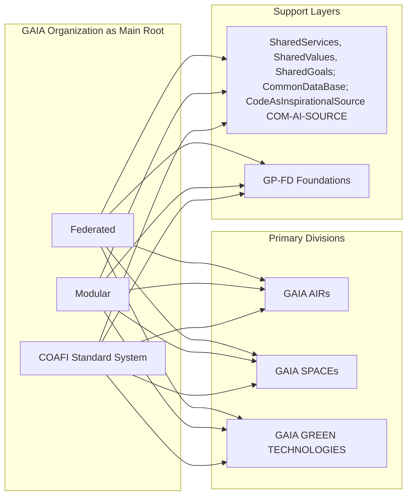

<!-- GAIA Platforms Root Index • See below for AIRs, SPACEs, GREENTECH and Foundations -->

# GAIA Organization

## 📘 Introducción

GAIA Organization es una iniciativa dedicada a impulsar el desarrollo sostenible y la innovación en los sectores aeroespacial, tecnológico y ambiental. Nuestra estructura federada permite la colaboración entre plataformas especializadas, alineadas bajo una misma misión ética y arquitectónica definida en el **Deontological Manifest**.

---

## 🛍 Misión y Visión Ética

Nuestra misión es catalizar soluciones responsables y de alto impacto para los grandes retos globales, promoviendo la colaboración abierta y la integridad científica.

La visión ética de GAIA se inspira en los principios definidos por [AMEDEO](https://github.com/AMEDEO-PELLICCIA) (Marco Ético-Ontológico) y las directrices de [PET.CORE](https://github.com/GAIA-DESARROLLO-SOSTENIBLE-G-DS) (Tecnologías Éticas Persistentes), priorizando la transparencia, la inclusión, la equidad y la sostenibilidad regenerativa en cada acción.

---

## 🧱 Arquitectura Institucional y Técnica

GAIA Organization está diseñada bajo una arquitectura modular y federada que facilita la interoperabilidad entre plataformas hijas y la adaptación a nuevos desafíos. Nuestra gobernanza y procesos técnicos siguen estándares abiertos y las mejores prácticas internacionales, documentados bajo el estándar **COAFI**.

- **Gobernanza federada:** Participación descentralizada, toma de decisiones colaborativa y responsabilidad distribuida.
- **Infraestructura técnica:** APIs estandarizadas, microservicios desacoplados, y repositorios claramente documentados para cada dominio funcional.
- **Gestión de conocimiento:** Uso de metadatos estructurados ([ver InfoCode](#📌-metadatos-infocode-y-footer-coafi)), trazabilidad vía COAFI, y enlaces semánticos a normativas externas e internas.



---

## 🌍 Modelos de Impacto y Convocatorias

GAIA impulsa modelos de impacto enfocados en:

- Transferencia tecnológica ética y co-creación con la industria, academia y sociedad civil.
- Programas de innovación abierta, retos tecnológicos y convocatorias colaborativas transparentes.
- Medición rigurosa de impacto ambiental, social, económico y ético (métricas ESG+E).

Consulta las próximas convocatorias y oportunidades de colaboración en nuestra [sección de noticias](./news.md) o contáctanos vía [gaia-contact@ejemplo.org](mailto:gaia-contact@ejemplo.org).

---

## 📡 Directorio de Plataformas (Divisiones Principales y Soporte)

Navega a las áreas clave del ecosistema GAIA:

- **Primary Divisions:**
  - [`./GAIA-AIRs/`](./GAIA-AIRs/) — Soluciones para aviación sostenible, ATM y sistemas atmosféricos.
  - [`./GAIA-SPACEs/`](./GAIA-SPACEs/) — Proyectos de tecnología espacial, astronautica civil y observación de la Tierra.
  - [`./GAIA-GREEN-TECHNOLOGIES/`](./GAIA-GREEN-TECHNOLOGIES/) — Innovación ambiental, energías limpias y tecnologías regenerativas.
- **Support Layers:**
  - [`./SharedServices/`](./SharedServices/) — Capacidades transversales (AI Core, Robótica, Logística).
  - [`./GP-FD/`](./GP-FD/) — Fundamentos, Doctrinas, Estándares (AMEDEO, COAFI, AToC).

Cada plataforma cuenta con su propio equipo, repositorio (`README.md`, `AToC.md`, `IDX.md`) y hoja de ruta detallada.

---

## 📌 Metadatos InfoCode y Footer COAFI

```plaintext
Status: Active
Filename: README.md
Version: 1.0
Domain: GP-GAIA-ROOT
InfoCode: OV, GOV, ARCH
Extensions: AToC-linked
Notes: Root organizational document. References AMEDEO, PET-CORE, COAFI.
COAFI Standard: v1.1
COAFI Footer: © 2025 GAIA Organization. Todos los derechos reservados.
```

---

### GAIA SPACE: Floating Spherical Platforms Full Lifecycle Implementation

> **GenAI Proposal Status**: This document represents a conceptual framework generated through AI assistance. It should be considered a proposal for implementing GAIA FLOPSHERES across the full lifecycle of aerospace platforms. Implementation details may require further technical refinement by domain experts.


## Executive Summary

This document outlines the comprehensive implementation of GAIA SPACE as Floating Spherical Platforms (FLOPSHERES) across the complete lifecycle of aerospace systems. The framework integrates the spherical operational paradigm with full lifecycle management, creating a seamless continuum from design through operation to recycling and regeneration.

## 1. Architectural Overview


## 2. GAIA SPACE Full Lifecycle Implementation

### 2.1 Core Principles

The GAIA SPACE Floating Spherical Platforms implementation is guided by four core principles:

1. **Spherical Continuity**: Maintaining the spherical paradigm across all lifecycle phases
2. **Ethical Permeation**: Embedding ethical considerations throughout the entire lifecycle
3. **Quantum Optimization**: Applying QAO principles to all lifecycle decisions
4. **Regenerative Design**: Ensuring each lifecycle phase contributes to regenerative outcomes


### 2.2 Lifecycle Phases

#### 2.2.1 Design Phase: Digital Twin Spheres

Digital Twin Spheres represent the conceptual and virtual implementation of FLOPSHERES during the design phase:

```yaml
digital_twin_sphere:
  id: "DTS-AERO-X-001"
  platform_type: "AERO_X"
  design_parameters:
    materials:
      - name: "Composite-A7"
        ethical_score: 0.92
        recycling_potential: 0.95
        carbon_footprint: 12.3  # kg CO2e/kg
      - name: "Alloy-QT5"
        ethical_score: 0.87
        recycling_potential: 0.88
        carbon_footprint: 18.7  # kg CO2e/kg
    
    energy_systems:
      primary: "Hydrogen-Electric"
      backup: "Solid-State Battery"
      regenerative_capacity: 0.65  # Proportion of energy recoverable
    
    lifecycle_budget:
      carbon: 120000  # kg CO2e total lifecycle
      materials: 8500  # kg total materials
      energy: 45000   # kWh total lifecycle
    
    ethical_boundaries:
      amedeo_minimum: 0.85
      social_impact_score: 0.80
      environmental_score: 0.90
    
    simulation_parameters:
      operational_lifespan: 25  # years
      maintenance_intervals: [2, 5, 10, 15, 20]  # years
      end_of_life_scenarios: ["full_reclamation", "partial_recycling", "component_reuse"]
```

#### 2.2.2 Deployment Phase: Transition Spheres

Transition Spheres manage the implementation of physical platforms and their initial integration into the FLOPSHERE ecosystem:

```plaintext
// GAIA SPACE Transition Sphere
// File: transition-sphere-aero-x.ampel
// Version: 1.0.0

namespace GAIA.SPACE.TRANSITION;

import GAIA.AMEDEO.Ethics;
import GAIA.QAO.Optimization;
import GAIA.SSM.Lifecycle;
import GAIA.DTX.TwinSync;

// Transition Sphere Definition
TransitionSphere AERO_X_TRANSITION {
  platform_id: "AERO-X-SN00421",
  digital_twin_ref: "DTS-AERO-X-001",
  
  certification_requirements: {
    regulatory: [
      "EASA.CS-23",
      "FAA.Part23",
      "ICAO.Annex16"
    ],
    ethical: [
      "AMEDEO.FULL",
      "PET-CORE.AVIATION",
      "GAIA.ETHICAL.AVIATION"
    ],
    performance: [
      "GAIA.FLOPS.PERFORMANCE",
      "QAO.EFFICIENCY.TIER1",
      "RAME.CERTIFICATION"
    ]
  },
  
  twin_synchronization: {
    initial_sync: "COMPREHENSIVE",
    verification_level: "HIGH",
    divergence_tolerance: 0.05,  // 5% maximum divergence
    calibration_points: [
      "STRUCTURAL_INTEGRITY",
      "ENERGY_SYSTEMS",
      "CONTROL_SYSTEMS",
      "ETHICAL_BOUNDARIES",
      "INTENTION_FIELD_GENERATORS"
    ]
  },
  
  flopshere_calibration: {
    initial_radius: 5000,  // meters
    ethical_boundary_verification: true,
    qao_field_initialization: {
      resolution: "HIGH",
      optimization_targets: [
        {name: "energy_efficiency", weight: 0.4},
        {name: "ethical_alignment", weight: 0.3},
        {name: "operational_safety", weight: 0.3}
      ]
    },
    intention_field_calibration: {
      coherence_target: 0.9,
      stability_period: "72h",
      verification_scenarios: [
        "STANDARD_OPERATION",
        "EMERGENCY_RESPONSE",
        "ETHICAL_EDGE_CASE",
        "FEDERATION_HANDOFF"
      ]
    }
  },
  
  deployment_sequence: {
    phases: [
      {name: "PHYSICAL_VERIFICATION", duration: "48h"},
      {name: "SYSTEMS_CALIBRATION", duration: "72h"},
      {name: "ETHICAL_BOUNDARY_TESTING", duration: "24h"},
      {name: "QAO_FIELD_INITIALIZATION", duration: "12h"},
      {name: "INTENTION_FIELD_CALIBRATION", duration: "36h"},
      {name: "FEDERATION_INTEGRATION", duration: "24h"}
    ],
    verification_gates: [
      {name: "PHYSICAL_INTEGRITY", criteria: "100% COMPLIANCE"},
      {name: "SYSTEMS_PERFORMANCE", criteria: "> 95% EFFICIENCY"},
      {name: "ETHICAL_COMPLIANCE", criteria: "AMEDEO > 0.90"},
      {name: "QAO_OPTIMIZATION", criteria: "> 90% TARGET ACHIEVEMENT"},
      {name: "INTENTION_COHERENCE", criteria: "> 0.85 COHERENCE"}
    ]
  },
  
  lifecycle_initialization: {
    carbon_accounting: {
      manufacturing_emissions: 35000,  // kg CO2e
      deployment_emissions: 2500,      // kg CO2e
      remaining_budget: 82500          // kg CO2e
    },
    material_tracking: {
      initialized: true,
      blockchain_record: "BITT-AERO-X-00421-MAT",
      verification_status: "COMPLETE"
    },
    regenerative_potential: {
      calculated: true,
      score: 0.87,  // 87% regenerative potential
      improvement_areas: [
        "COMPOSITE_RECYCLING",
        "ENERGY_RECOVERY",
        "RARE_EARTH_RECLAMATION"
      ]
    }
  }
}

// Execute transition
execute {
  sphere: AERO_X_TRANSITION,
  mode: "SEQUENTIAL",
  verification: "CONTINUOUS",
  documentation: "COMPREHENSIVE",
  audit_trail: "BITT-IMMUTABLE"
}
```

#### 2.2.3 Operation Phase: Active FLOPSHERES

Active FLOPSHERES represent the operational implementation of the spherical paradigm:

```yaml
active_flopshere:
  id: "FS-GP-AM-421X"
  platform: "AERO-X-SN00421"
  operational_status: "ACTIVE"
  
  current_mission:
    id: "GAIA_421_A1"
    type: "PASSENGER_TRANSPORT"
    route: "EDDF-EDDM"
    phase: "CRUISE"
    
  sphere_parameters:
    current_center: [48.353889, 11.786111, 10000]  # lat, lon, alt
    current_radius: 8500  # meters
    ethical_boundary_status: "NOMINAL"
    qao_field_status: "OPTIMIZED"
    intention_coherence: 0.93
    
  lifecycle_tracking:
    mission_count: 142
    flight_hours: 487.5
    carbon_consumed: 42500  # kg CO2e
    carbon_remaining: 40000  # kg CO2e
    maintenance_status: "GREEN"
    component_health:
      propulsion: 0.92
      structure: 0.95
      avionics: 0.89
      ethical_systems: 0.94
    
  regenerative_actions:
    energy_recovery: 0.68  # 68% of energy recovered
    emissions_offset: 38000  # kg CO2e offset
    positive_impact_score: 0.82
    
  federation_status:
    connected_spheres: 3
    mesh_coherence: 0.91
    trust_level: "HIGH"
    collaborative_optimization: "ACTIVE"
```

#### 2.2.4 Regeneration Phase: Recycling Spheres

Recycling Spheres manage the end-of-life processes and material regeneration:

```plaintext
// GAIA SPACE Recycling Sphere
// File: recycling-sphere-aero-x.ampel
// Version: 1.0.0

namespace GAIA.SPACE.RECYCLING;

import GAIA.AMEDEO.Ethics;
import GAIA.QAO.Optimization;
import GAIA.SSM.Lifecycle;
import GAIA.RAME.Regeneration;

// Recycling Sphere Definition
RecyclingSphere AERO_X_RECYCLING {
  platform_id: "AERO-X-SN00421",
  lifecycle_status: "END_OF_LIFE",
  operational_history: {
    total_missions: 3842,
    total_flight_hours: 12487.5,
    carbon_consumed: 118500,  // kg CO2e
    carbon_offset: 122000,    // kg CO2e (net positive)
    ethical_impact_score: 0.91
  },
  
  component_reclamation: {
    strategy: "MAXIMUM_REGENERATION",
    components: [
      {
        name: "Propulsion System",
        reclamation_method: "COMPONENT_REUSE",
        reclamation_rate: 0.75,
        destination: "AERO-X-NEXT-GEN"
      },
      {
        name: "Structural Elements",
        reclamation_method: "MATERIAL_RECYCLING",
        reclamation_rate: 0.92,
        destination: "COMPOSITE_REPROCESSING"
      },
      {
        name: "Avionics Systems",
        reclamation_method: "REFURBISHMENT",
        reclamation_rate: 0.85,
        destination: "AVIONICS_POOL"
      },
      {
        name: "Energy Storage",
        reclamation_method: "ELEMENT_EXTRACTION",
        reclamation_rate: 0.95,
        destination: "BATTERY_RECYCLING"
      }
    ],
    total_material_reclamation: 0.89  // 89% of materials reclaimed
  },
  
  material_regeneration: {
    processes: [
      {
        material: "Composite-A7",
        process: "THERMAL_DECOMPOSITION",
        regeneration_rate: 0.92,
        energy_requirement: 12500,  // kWh
        carbon_impact: -8500        // kg CO2e (negative = sequestered)
      },
      {
        material: "Alloy-QT5",
        process: "ELECTROLYTIC_SEPARATION",
        regeneration_rate: 0.97,
        energy_requirement: 8700,   // kWh
        carbon_impact: -6200        // kg CO2e
      }
    ],
    circular_economy_metrics: {
      material_circularity: 0.94,
      energy_recovery: 0.72,
      carbon_sequestration: 14700   // kg CO2e
    }
  },
  
  carbon_accounting: {
    lifecycle_emissions: 118500,    // kg CO2e
    lifecycle_offsets: 122000,      // kg CO2e
    recycling_sequestration: 14700, // kg CO2e
    net_carbon_impact: -18200,      // kg CO2e (negative = beneficial)
    verification_method: "BLOCKCHAIN_IMMUTABLE",
    verification_id: "BITT-AERO-X-00421-CARBON"
  },
  
  knowledge_transfer: {
    operational_insights: {
      captured: true,
      destination: "GAIA_KNOWLEDGE_SPHERE",
      application: "NEXT_GEN_DESIGN"
    },
    ethical_learnings: {
      captured: true,
      destination: "AMEDEO_LEARNING_NETWORK",
      application: "ETHICAL_BOUNDARY_REFINEMENT"
    },
    qao_optimization_data: {
      captured: true,
      destination: "QAO_FIELD_LIBRARY",
      application: "EFFICIENCY_ENHANCEMENT"
    }
  },
  
  regenerative_outcome: {
    net_environmental_impact: "POSITIVE",
    net_social_impact: "POSITIVE",
    net_economic_impact: "POSITIVE",
    regenerative_score: 0.93,
    next_generation_contribution: {
      enabled: true,
      target_platforms: ["AERO-X-NEXT-GEN", "AERO-Z"],
      improvement_potential: 0.25  // 25% improvement in next generation
    }
  }
}

// Execute recycling process
execute {
  sphere: AERO_X_RECYCLING,
  mode: "REGENERATIVE",
  verification: "CONTINUOUS",
  documentation: "COMPREHENSIVE",
  audit_trail: "BITT-IMMUTABLE"
}
```

## 3. Implementation Framework

### 3.1 GAIA SPACE Floating Platform Implementation Matrix

| Lifecycle Phase | Spherical Implementation | Ethical Implementation | QAO Implementation | Regenerative Implementation
|-----|-----|-----|-----|-----
| **Design** | Digital Twin Spheres | Ethical Material Selection | Design Space Optimization | Regenerative Design Principles
| **Deployment** | Transition Spheres | Ethical Boundary Verification | Initial QAO Field Calibration | Lifecycle Budget Initialization
| **Operation** | Active FLOPSHERES | Continuous Ethical Monitoring | Dynamic QAO Field Optimization | Ongoing Regenerative Actions
| **Regeneration** | Recycling Spheres | Ethical Impact Assessment | Reclamation Optimization | Material & Knowledge Regeneration


### 3.2 Technical Requirements

#### 3.2.1 Core Systems

1. **Spherical Lifecycle Manager**

1. Coordinates transitions between lifecycle phases
2. Maintains spherical continuity across phases
3. Ensures data integrity between sphere types


2. **Ethical Boundary Engine**

1. Applies ethical constraints across all lifecycle phases
2. Adapts ethical boundaries based on lifecycle context
3. Provides XAI explanations for lifecycle decisions


3. **QAO Lifecycle Optimizer**

1. Optimizes decisions across entire lifecycle
2. Balances immediate vs. long-term optimization
3. Maintains quantum field continuity across phases


4. **Regenerative Action Orchestrator**

1. Identifies and executes regenerative opportunities
2. Tracks regenerative impact across lifecycle
3. Ensures net-positive outcomes


#### 3.2.2 Integration Requirements

```yaml
integration_requirements:
  digital_twin_integration:
    continuity: "FULL_LIFECYCLE"
    synchronization_frequency:
      design: "ON_CHANGE"
      deployment: "CONTINUOUS"
      operation: "REAL_TIME"
      regeneration: "ON_CHANGE"
    divergence_handling: "ADAPTIVE_RECONCILIATION"
    
  blockchain_immutability:
    record_types:
      - "MATERIAL_FLOW"
      - "CARBON_ACCOUNTING"
      - "ETHICAL_DECISIONS"
      - "REGENERATIVE_ACTIONS"
    verification_method: "DISTRIBUTED_CONSENSUS"
    retention_period: "PERMANENT"
    
  knowledge_management:
    capture_points:
      - "DESIGN_DECISIONS"
      - "DEPLOYMENT_LEARNINGS"
      - "OPERATIONAL_INSIGHTS"
      - "REGENERATION_OUTCOMES"
    application_mechanism: "CONTINUOUS_IMPROVEMENT"
    cross_generation_transfer: "AUTOMATED"
    
  federation_requirements:
    sphere_type_interoperability: "SEAMLESS"
    cross_phase_communication: "STANDARDIZED"
    intention_field_continuity: "MAINTAINED"
    ethical_boundary_consistency: "ENFORCED"
```

## 4. Implementation Roadmap

### 4.1 Phase 1: Foundation (2025-2026)

- Develop core GAIA SPACE Floating Spherical Platform specifications
- Create reference implementations for each sphere type
- Establish lifecycle transition protocols
- Develop initial integration with existing GAIA PLATFORMS components


### 4.2 Phase 2: Pilot Implementation (2026-2027)

- Deploy pilot implementations for selected platforms
- Test full lifecycle transitions
- Validate ethical continuity across lifecycle
- Measure regenerative outcomes


### 4.3 Phase 3: Ecosystem Development (2027-2028)

- Expand to multiple platform types
- Develop federation capabilities across lifecycle phases
- Enhance regenerative optimization algorithms
- Integrate with global sustainability frameworks


### 4.4 Phase 4: Full Deployment (2028-2030)

- Deploy across all compatible aerospace platforms
- Establish industry standards for lifecycle spheres
- Achieve measurable regenerative outcomes
- Create self-sustaining ecosystem of floating spherical platforms


## 5. Case Study: AERO-X Full Lifecycle Implementation

### 5.1 Design Phase

The AERO-X platform begins as a Digital Twin Sphere, where materials, energy systems, and operational parameters are optimized for full lifecycle performance. Ethical boundaries are established, and regenerative potential is calculated.


### 5.2 Deployment Phase

The AERO-X transitions to physical implementation through a Transition Sphere, which manages certification, digital twin synchronization, and initial FLOPSHERE calibration.

### 5.3 Operation Phase

The AERO-X operates as an Active FLOPSHERE, navigating through intention fields, maintaining ethical boundaries, and continuously optimizing its performance while tracking lifecycle metrics.

### 5.4 Regeneration Phase

At end-of-life, the AERO-X enters a Recycling Sphere, where components are reclaimed, materials regenerated, and knowledge transferred to next-generation platforms.

## 6. Metrics and Success Criteria

### 6.1 Lifecycle Continuity Metrics

- **Spherical Continuity Index**: Measures maintenance of spherical paradigm across lifecycle (target: >0.90)
- **Data Integrity Score**: Measures information preservation between lifecycle phases (target: >0.95)
- **Intention Field Coherence**: Measures consistency of intention across lifecycle (target: >0.85)


### 6.2 Ethical Performance Metrics

- **Lifecycle Ethical Score**: Measures ethical performance across entire lifecycle (target: >0.90)
- **Ethical Boundary Stability**: Measures consistency of ethical boundaries (target: >0.95)
- **XAI Explanation Coverage**: Measures comprehensiveness of ethical explanations (target: 100%)


### 6.3 Regenerative Outcome Metrics

- **Material Circularity**: Percentage of materials reclaimed and regenerated (target: >90%)
- **Carbon Positivity**: Net carbon impact across lifecycle (target: negative/sequestering)
- **Knowledge Transfer Rate**: Effectiveness of insights applied to next generation (target: >80%)


## 7. Conclusion

The GAIA SPACE Floating Spherical Platforms Full Lifecycle Implementation represents a comprehensive approach to aerospace systems that maintains the spherical paradigm across all lifecycle phases. By implementing Digital Twin Spheres, Transition Spheres, Active FLOPSHERES, and Recycling Spheres, the framework ensures continuity of ethical boundaries, QAO fields, and regenerative actions from design through operation to end-of-life.

This implementation transforms aerospace platforms from linear lifecycle products to regenerative nodes in a continuous, ethical, and optimized spherical ecosystem. The result is a truly sustainable approach to aerospace that generates net-positive outcomes for the environment, society, and future generations.

---

Would you like me to elaborate on any specific aspect of this GAIA SPACE Floating Spherical Platforms Full Lifecycle Implementation framework?
\- Amedeo PELLICCIA


